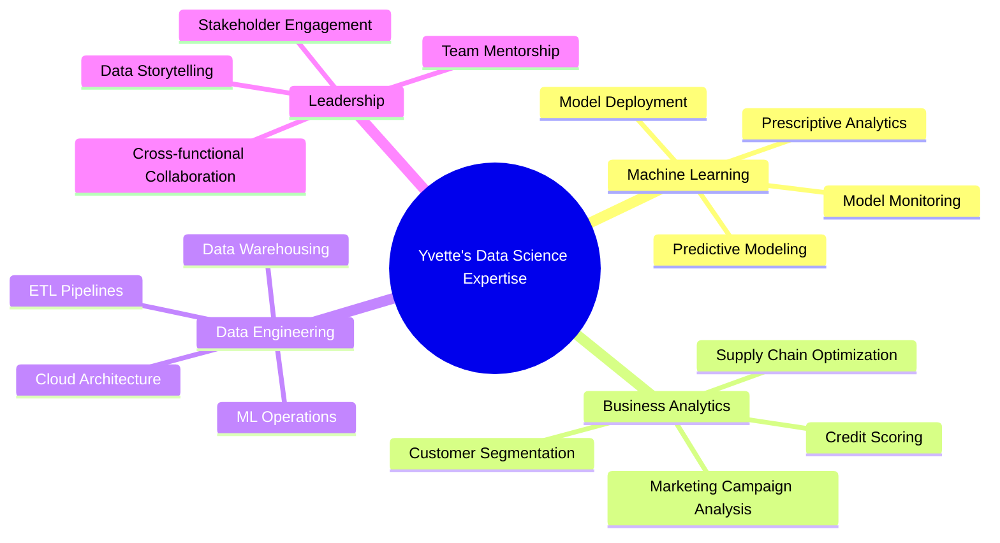

# Hi there, I'm Yvette Kondoh 👋

  

  
  
  

  

  
  

---

## 🔥 Featured Projects 

  

  

    <!-- Project 1 -->
    
    <!-- Project 2 -->
    
    <!-- Project 3 -->
    
  

  
---

## 🛠️ Language & Technology Stack

## 🏅 Certifications & Education

### 🎓 **Education**
**Master of Science: Applied Statistics** - Loyola University Chicago (2015)  
**Bachelor of Science: Actuarial Science** - Kwame Nkrumah University of Science and Technology (2012)

### 🏆 **Professional Certifications**

---

## 📊 Domain Expertise

 
