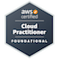
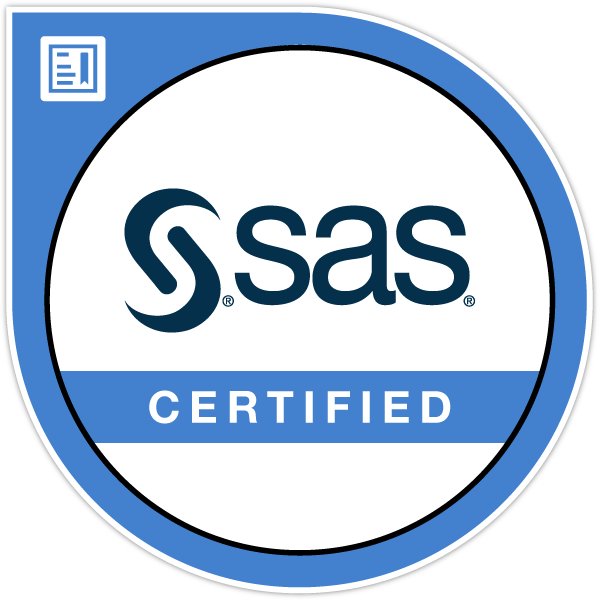

### Hi there! 👋

#### I'm [**Yvette**](https://www.linkedin.com/in/yvettekondoh/), a **`Data Scientist`** with 6+ years' cross-industry experience working in Ghana and USA.  

 

- 🎓 2012: Obtained BSc in **`Actuarial Science`** (K.N.U.S.T, Kumasi - Ghana)
- 🎓 2015: Obtained MS in **`Applied Statistics`** (Loyola University Chicago, USA)

- 🙋‍♀️ 2016: Volunteered as **`a data analyst at a non-profit org`** in Chicago, USA, **`generating and testing hypotheses to guide business decision`**
- 👩‍💻 2017: Started working as **`a data scientist`** in Accra, Ghana, mostly **`buiding credit score models with alternative data for clients in fintech, agritech and telco industry`**
- ✈️ 2020: Relocated to the USA. **`Promoted to assistant data science manager`** and worked remotely to **`build predictive customer analytic models for a client in the micropension industry`**
- 💼 2021: Started working as **`a marketing data scientist`** in USA, **`buiding forecast models for website engagement and clone models for precision marketing using big (1p and 3p) data`**
- 👩‍🏫 2023: **`Mentoring`** aspiring data analysts and data scientists and started working as a **`a supply chain data scientist in a multinational company in the CPG industry`**

- 🌱 I’m currently preparing for the Google Cloud Professional Data Engineering Certification Exam
- 💻 You can find my data projects [*here*](https://www.datascienceportfol.io/yvetteekon)
- ✍️ Check out my blog posts [*here*](https://medium.com/@ykondoh)
- 💬 Quote I live by: **"Anything worth doing is worth training for"** - *Rev. Dr. Chris Oyakhilome D.Sc. D.D*
<!-- - 🎯 Take a look at my personal pitch deck [*here*](https://drive.google.com/file/d/1fiE_Z_L_5TGHhzP-F1G8eAR4G9uGhVV9/view?usp=sharing) -->

---
 **Certifications:** 

---
 **Languages/Tech Stack:** 

---
 **Data Competition:**

- “Can you help reduce employee attrition?” | March 2022 |  **`5th Position`** [*datacamp*](https://app.datacamp.com/workspace/w/ab949f18-f50d-43b4-bb97-750ec06510bd)
<!-- - “How can the company improve collaboration?” | November 2022 |      [*datacamp*](https://app.datacamp.com/workspace/w/261bd35c-a7da-46ea-91a5-fa6d6a7212fe) -->
<!-- - “How can hospitals reduce readmissions?” | March 2023 |       [*datacamp*](https://app.datacamp.com/workspace/w/a2c4e79e-9cce-4e66-836d-1c1402bd111e) -->

---

###  Metrics

  

  

 

---

<!-- ###  Featured Repos -->
###  Featured Repos

 
