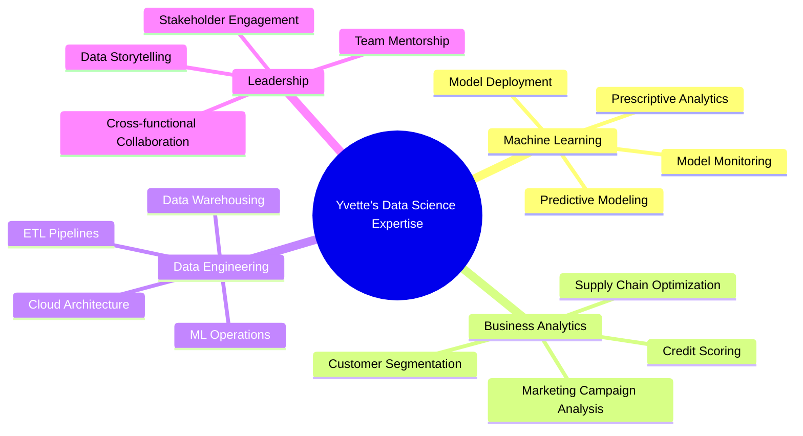

# Hi there, I'm Yvette Kondoh 👋

  

  
  
  

  

  
  

---

## 🔥 Featured Projects 

  

  

    <!-- Project 1 -->
    
    <!-- Project 2 -->
    
    <!-- Project 3 -->
    
  

---

## 🏅 Certifications & Education

### 🎓 **Education**
**Master of Science: Applied Statistics** - Loyola University Chicago (2015)  
**Bachelor of Science: Actuarial Science** - Kwame Nkrumah University of Science and Technology (2012)

### 🏆 **Professional Certifications**

## 🛠️ Technology Stack

### 💻 Programming & Analytics

### 🤖 Machine Learning & AI

### 📊 Data Visualization & BI

### ☁️ Cloud & Deployment

---

## 📊 Domain Expertise

---

## 🤝 Leadership & Community

### 🎤 **Toastmasters International**
- **President** - Interpersonal Toastmasters Club (July 2025 - Present)
- **Treasurer** - (January 2024 - June 2025)
- **Member since August 2023**

### 👩‍🏫 **Data Science Mentorship**
- **Data Mentor @ OpenClassrooms** (June 2023 - Present)
- Mentoring 7+ students in SQL, Python, Tableau, PowerBI, and AI project management
- Achieved **100% first-pass approval rate** for student assessments
- Specializing in machine learning and data storytelling techniques

 
