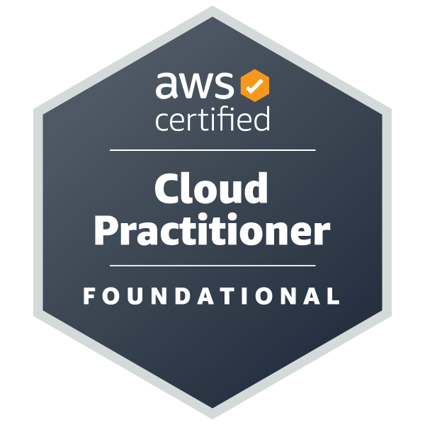

 

### Hi there! 👋

#### I'm [**Yvette**](https://www.linkedin.com/in/yvettekondoh/), a **`Data Scientist`** with 6+ years' cross-industry experience working in Ghana and USA.  

<!--  -->

 

- 🎓 I hold a bachelor's degree and master's degree in **Actuarial Science** and **Applied Statistics** respectively
- 💼 My areas of experience include **credit score modeling** using alternative data, **predictive customer analytics modeling**, **marketing data science**, **forecast modeling**, **supply chain analytics and supply chain data science**
- 🏭 My industries of exposure include **fintech, agritech, adtech, micropensions, consumer packaged goods (CPG)** industries
- 👩‍🏫 I enjoy **mentoring** and **solving word puzzles**
- 🌱 I’m currently improving on my **software and data engineering skills, presentation skills and networking skills**
- 💻 You can find my data projects [*here*](https://www.datascienceportfol.io/yvetteekon)
- ✍️ Check out my blog posts [*here*](https://medium.com/@ykondoh)

<!-- - 🎯 Take a look at my personal pitch deck [*here*](https://drive.google.com/file/d/1fiE_Z_L_5TGHhzP-F1G8eAR4G9uGhVV9/view?usp=sharing) -->

---
 **Certifications:** 

---
 **Languages/Tech Stack:** 

---
 **Data Competition:**

- “Can you help reduce employee attrition?†| March 2022 |  **`5th Position`** [*datacamp*](https://app.datacamp.com/workspace/w/ab949f18-f50d-43b4-bb97-750ec06510bd)
<!-- - “How can the company improve collaboration?” | November 2022 |      [*datacamp*](https://app.datacamp.com/workspace/w/261bd35c-a7da-46ea-91a5-fa6d6a7212fe) -->
<!-- - “How can hospitals reduce readmissions?” | March 2023 |       [*datacamp*](https://app.datacamp.com/workspace/w/a2c4e79e-9cce-4e66-836d-1c1402bd111e) -->

---

###  Metrics

  

  

 

---

<!-- ###  Featured Repos -->
###  Featured Repos

 
